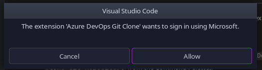
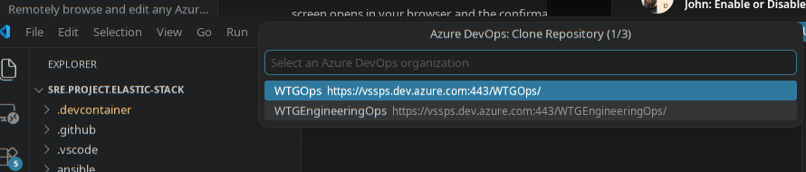
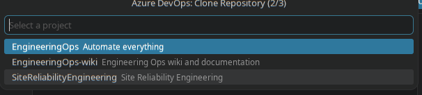
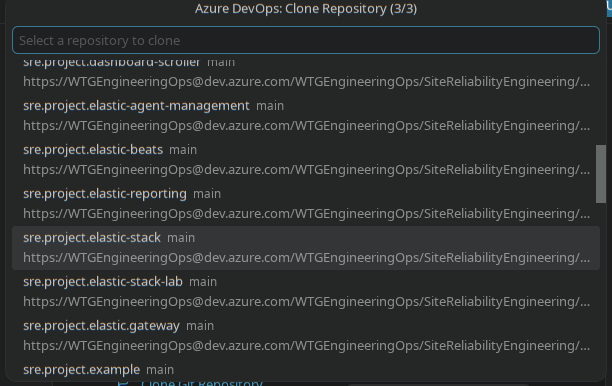

# Azure DevOps Git Clone

[](https://marketplace.visualstudio.com/items?itemName=ashurtechnet.azure-devops-git-clone)
[](https://marketplace.visualstudio.com/items?itemName=ashurtechnet.azure-devops-git-clone)
[](LICENSE)

imagine if you could clone azure git repos in vscode as easily as you can do with github repos.....

imagine a vscode extension so obvious that the benevolent corporate behemoth behind both vscode and devops forgot to implement it...

...an extension so basic that when asked claude said 'ugh just ask gemini or something'...

well, stop wasting time imagining things and get back to work, it's real now

1. click


2. click



3. login via ms/entra prompts


4. select org



5. select project



6. pick a repo, give it a destination, done



priced at $0, no telemetry or any data collection. but if you're all hung up about transactions, feel free to take $50 out of your bank account and then send it back to yourself immediately, you've earned it!

## The fine print

- **One-click sign-in** — uses VS Code's built-in Microsoft authentication. The Azure login opens in your browser and returns to VS Code automatically (with a copy & paste fallback if it can't). First run only — VS Code remembers the session.
- **Browse, don't paste** — pick your **organization → project → repository** from searchable quick-pick lists. No Personal Access Tokens to juggle, no URLs to copy out of the browser.
- **Native clone experience** — hands off to VS Code's built-in `git.clone`, so you get the same folder picker, progress, and *"Open cloned repository"* prompt as the welcome page's **Clone Git Repository** action. Also available from the Command Palette (`Ctrl+Shift+P`) as **Azure DevOps: Clone Git Repository**.

## Requirements

- VS Code 1.85 or newer
- The built-in Git extension (enabled by default)
- A Microsoft / Entra ID account with access to your Azure DevOps organizations

## How it works

The extension requests an access token for the Azure DevOps resource (`499b84ac-1321-427f-aa17-267ca6975798/.default`) through VS Code's Microsoft authentication provider, then calls the Azure DevOps REST API to enumerate your organizations, projects, and repositories. The selected repository's remote URL is passed to the built-in Git extension for cloning; Git's credential manager handles repository authentication from there.

## Developing

```bash
npm install
npm run compile   # or: npm run watch
```

Press `F5` to launch an Extension Development Host, or use the **Package VSIX (Marketplace)** debug configuration to build an installable `.vsix`.

## Links

- [Marketplace listing](https://marketplace.visualstudio.com/items?itemName=ashurtechnet.azure-devops-git-clone)
- [Source code & issues](https://github.com/zacpr/azure-devops-git-clone)
